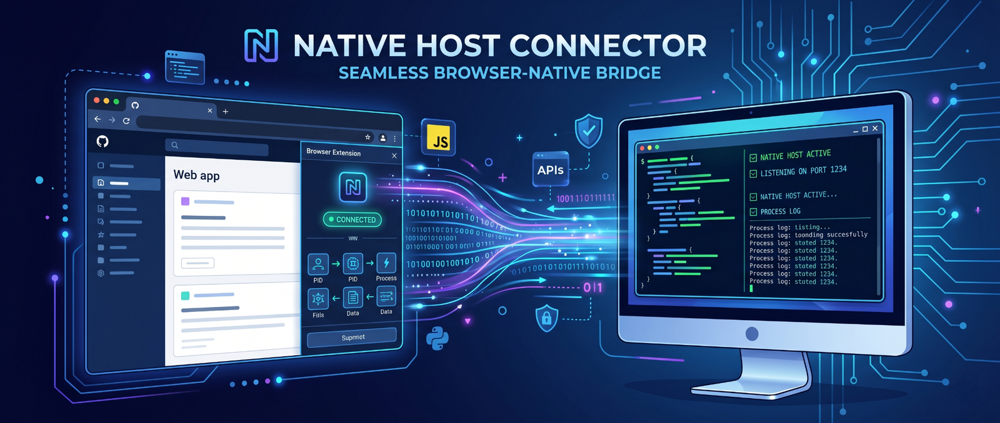
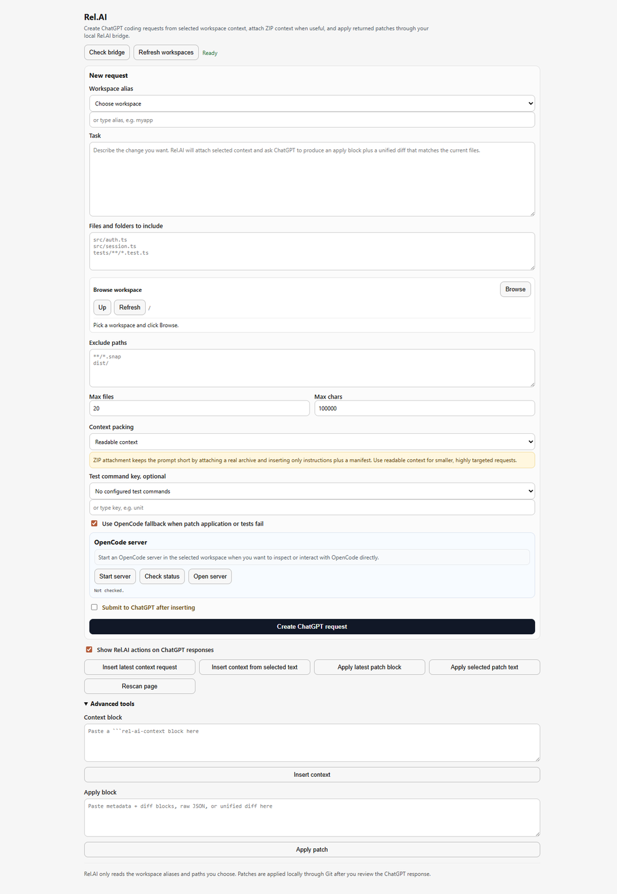
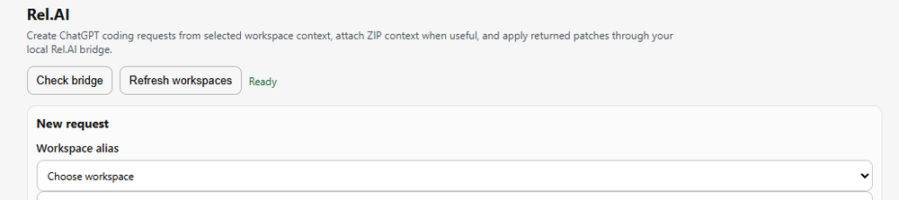
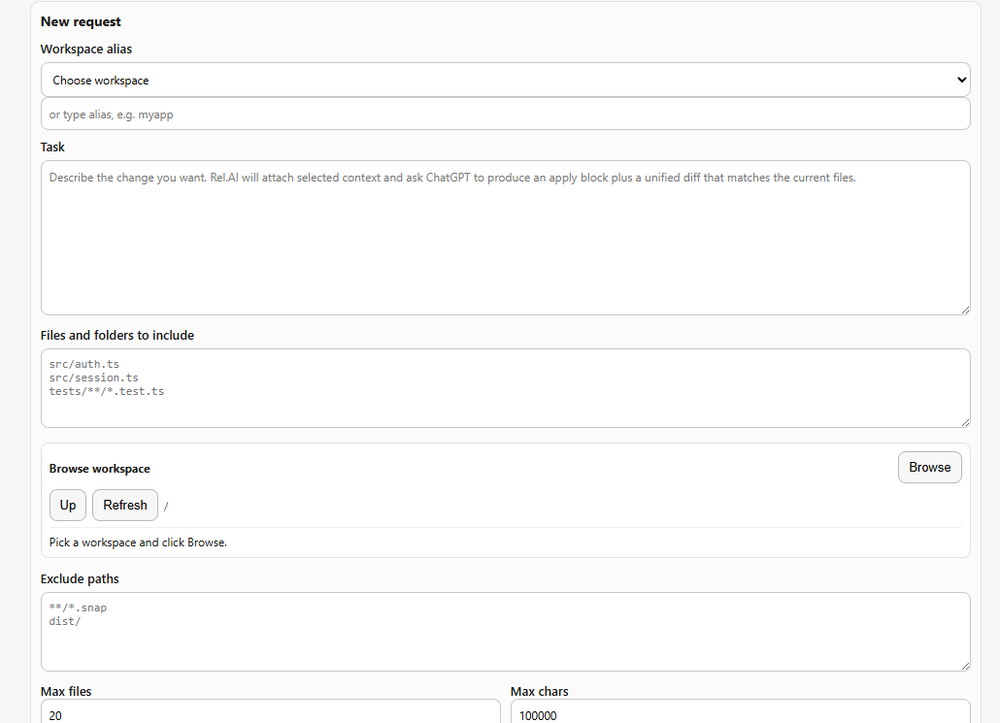
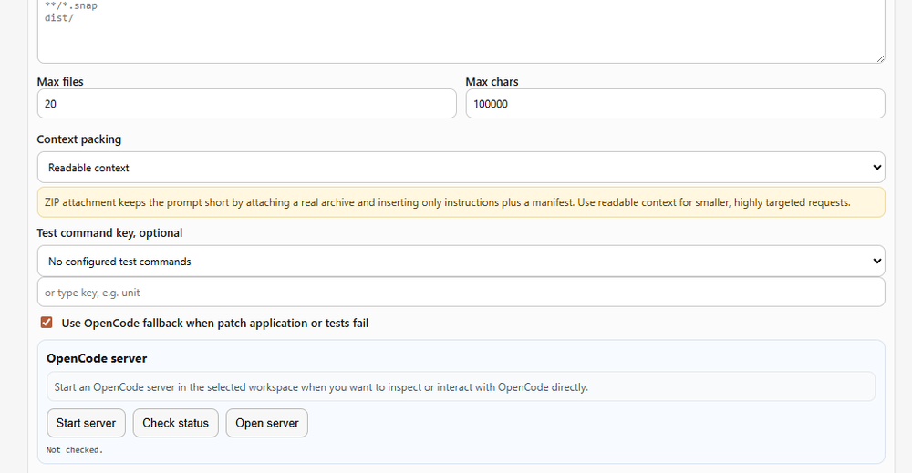
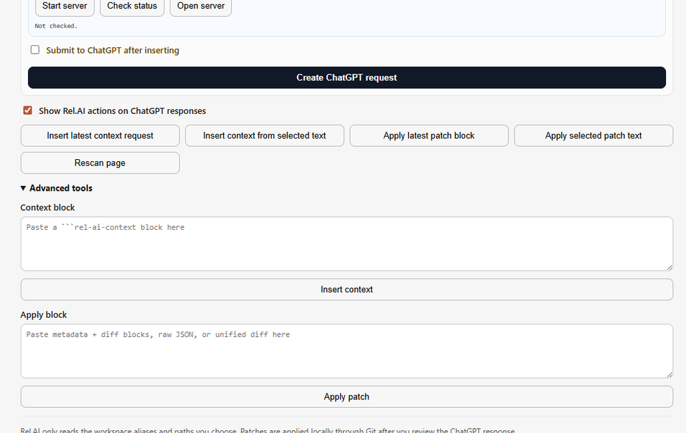

# Rel.AI

<p align="center">
  
</p>

Rel.AI creates ChatGPT coding requests from selected local workspace context, attaches ZIP context when useful, and applies returned patches through a local native bridge.

It is designed for this flow:

```text
You choose a workspace alias, allowed files/folders/globs, and a task
-> Rel.AI reads only the selected local context
-> Rel.AI inserts a complete request into the open ChatGPT web composer
-> ChatGPT returns rel-ai-apply metadata plus a separate unified diff
-> Rel.AI checks and applies the diff locally with git apply
-> OpenCode can be used as a fallback if patch application or tests fail
```

ChatGPT cannot silently browse your disk. Rel.AI reads local files through the native host only after you choose the workspace alias and allowed paths in the dashboard.

## Why I made this

Rel.AI was created to make the ChatGPT web experience usable for real local coding work. The original problem was simple: Codex-style workflows were either unavailable or too expensive to rely on, while the models available through OpenCode were not strong enough for the heavier reasoning tasks I wanted to solve.

I had access to ChatGPT 5.5 Thinking on the web, and I wanted to use that reasoning capability to plan fixes, solve bugs, and produce code changes without manually copying patches back and forth into local files. Rel.AI bridges that gap: ChatGPT does the heavy reasoning, while local tools apply and verify changes safely.

OpenCode still matters in this design, but it is not the main thinker. Rel.AI uses OpenCode as an optional local fallback when a patch or test run fails, while Git remains the deterministic path for applying clean diffs.

---

## Dashboard



The dashboard opens as a full browser tab when you click the Rel.AI extension icon.

### 1. Bridge and workspace controls



- **Check bridge** verifies that the browser extension can reach the native host.
- **Refresh workspaces** reloads your configured workspace aliases.
- The status label shows whether the bridge is ready.

### 2. Request builder



Use this section to define the request that will be sent to ChatGPT.

- **Workspace alias** chooses the local project Rel.AI may read from.
- **Task** is the user prompt. Rel.AI no longer uses a separate title field; the task is the task.
- **Files and folders to include** controls what local context ChatGPT receives.
- **Browse workspace** lets you add folders/files without typing paths manually.
- **Exclude paths** removes noisy or generated files from the context.

### 3. Context packing, tests, and OpenCode



- **Readable context** inserts selected files directly into the ChatGPT prompt. Use this for small, precise changes.
- **ZIP attachment** creates a real `.zip` file and attaches it to ChatGPT, keeping the prompt shorter for larger context.
- **Test command key** selects a locally allowlisted test command. ChatGPT cannot directly provide arbitrary shell commands by default.
- **OpenCode fallback** can repair failed patches/tests when enabled.
- **OpenCode server** starts or opens an OpenCode server for direct local interaction.

### 4. ChatGPT actions and advanced tools



- **Create ChatGPT request** inserts the generated request into the open ChatGPT tab.
- **Show Rel.AI actions on ChatGPT responses** controls inline buttons under valid ChatGPT patch responses.
- Quick actions can insert context or apply patch blocks from the current ChatGPT page.
- Advanced tools are available for manual context and patch testing.
- Diagnostics are hidden by default. Press **Ctrl+Shift+D** on the dashboard to show or hide them.

---

## Requirements

- Node.js 18+
- Git available on `PATH`
- Chrome or Edge
- OpenCode installed only if you want fallback repair or server interaction

---

## Install

From the project root:

```bash
npm run check
```

Load the browser extension:

```text
chrome://extensions
-> Developer mode
-> Load unpacked
-> select apps/browser-extension
```

Copy the extension ID, then install the native host:

```bash
npm run install:chrome-host -- --extension-id YOUR_EXTENSION_ID
```

For Edge:

```bash
npm run install:edge-host -- --extension-id YOUR_EXTENSION_ID
```

Add a workspace alias:

```bash
npm run workspace:add -- myapp /absolute/path/to/project
```

Optional: add a locally approved test command:

```bash
npm run testcmd:add -- myapp unit "npm test -- --runInBand"
```

Optional: choose a cheaper OpenCode fallback model locally:

```bash
npm run model:set -- openai/gpt-4.1-mini
```

Rel.AI intentionally keeps the fallback model configured locally. ChatGPT does not choose your local OpenCode model.

---

## Main workflow

1. Open ChatGPT in Chrome or Edge.
2. Click the Rel.AI extension icon to open the dashboard.
3. Click **Refresh workspaces**.
4. Choose or type a workspace alias, such as `myapp`.
5. Describe the task.
6. Add allowed files, folders, or globs manually, or use the workspace browser.
7. Choose **Readable context** for small tasks or **ZIP attachment** for larger context.
8. Optionally select a `testCommandKey`.
9. Click **Create ChatGPT request**.
10. Review the inserted request in ChatGPT, then send it.
11. When ChatGPT returns a `rel-ai-apply` metadata block plus a separate `diff` block, click **Apply with Rel.AI**.
12. Review the pre-apply panel, then run **Check only** or **Apply patch**.

The dashboard has an optional **Submit to ChatGPT after inserting** checkbox. Keep it off if you want to review the final prompt before sending.

---

## Context strategy

Rel.AI provides ChatGPT with four kinds of context:

1. **Compact project file tree** by default, preserving exact path casing across the workspace. This helps ChatGPT avoid duplicate files such as `readme.md` when `README.md` already exists.
2. **Selected file contents** from the include list.
3. **ZIP context** for larger folder selections.
4. **Task-mentioned files** that already exist in the workspace, such as `README.md`, even when they were outside the selected folder.

The project file tree is an index of known workspace paths, not full file contents. If ChatGPT needs to edit a tree-only file whose contents were not included, Rel.AI instructs it to ask for more context instead of guessing.

Rel.AI also warns ChatGPT to treat the attached/readable context as the current repo state and to avoid creating files with `/dev/null` or `new file mode` unless the file is absent from the file tree, manifest, and task-mentioned file check.

---

## Output format

Rel.AI avoids putting raw multiline diffs inside JSON strings. ChatGPT is instructed to return exactly two fenced blocks.

First block: metadata only, no `diff` field and no `title` field:

````text
```rel-ai-apply
{
  "version": 1,
  "workspace": "myapp",
  "prompt": "Fix the auth refresh bug. Keep the public API unchanged.",
  "testCommandKey": "unit",
  "fallback": {
    "enabled": true,
    "tool": "opencode",
    "instructions": "If the patch or tests fail, make the smallest safe repair. Do not refactor unrelated code."
  }
}
```
````

Second block: unified diff:

````text
```diff
diff --git a/src/auth.ts b/src/auth.ts
--- a/src/auth.ts
+++ b/src/auth.ts
@@ -1,1 +1,1 @@
-old
+new
```
````

The browser extension combines these two blocks when you click **Apply with Rel.AI**.

---

## Pre-apply preview

When ChatGPT returns a valid apply response, the inline **Apply with Rel.AI** button opens a confirmation panel first. It shows:

- workspace alias
- affected files
- configured test command key
- whether OpenCode fallback is enabled
- the unified diff that will be sent to `git apply`

Use **Check only** to run `git apply --check` without changing files. Use **Apply patch** to modify the workspace.

If a patch fails, Rel.AI surfaces the real `git apply --check` / `git apply` stdout and stderr so you can see the exact cause.

---

## How Rel.AI changes your original code

When you click **Apply with Rel.AI**, the browser extension sends the metadata and diff to the native host `com.relai.request_builder`.

The native host resolves the workspace alias from `~/.rel-ai/opencode.json`, writes the diff to a temporary file, then runs these commands inside the workspace:

```bash
git apply --check /tmp/relai-diff-*/patch.diff
git apply --whitespace=warn /tmp/relai-diff-*/patch.diff
```

The actual file modifications are done by Git patch application. ChatGPT does not write files directly, and the browser extension does not write files directly.

OpenCode only runs if fallback is enabled and patch application or tests fail.

---

## OpenCode fallback and server

Rel.AI can use OpenCode in two ways:

- **Fallback repair**: if Git patch application or tests fail, OpenCode can attempt the smallest safe local repair.
- **Server interaction**: the dashboard can start, check, or open an OpenCode server for the selected workspace.

Fallback status is written under `.relai/` in the workspace, including `fallback-latest.json`, so you can verify whether OpenCode started, completed, failed, or timed out.

Optional server config:

```bash
node apps/native-host/scripts/relai-config.js set opencode-server-url http://127.0.0.1:4096
node apps/native-host/scripts/relai-config.js set opencode-server-args serve
```

---

## Safety behavior

Rel.AI blocks:

- absolute paths
- `..` traversal
- paths outside the allowlisted workspace
- common secret paths such as `.env`, `.ssh`, `.npmrc`, `*.pem`, `*.key`, and credential files
- binary-looking files in context bundles
- direct test commands from ChatGPT unless you explicitly enable them
- full workspace reads without explicit include patterns

Rel.AI prefers locally configured test commands:

```json
{
  "workspaces": {
    "myapp": {
      "path": "/absolute/path/to/project",
      "testCommands": {
        "unit": "npm test -- --runInBand"
      }
    }
  }
}
```

Config path:

```text
~/.rel-ai/opencode.json
```

---


## Debug mode

Diagnostics are hidden in normal use so the dashboard stays release-ready. To open the debug panel, press **Ctrl+Shift+D** while the Rel.AI dashboard is focused.

Debug mode shows recent bridge events, request-building steps, ZIP upload status, native-host responses, and apply/fallback details. Use **Copy debug log** when reporting issues, then press **Ctrl+Shift+D** again to hide diagnostics.

---

## Troubleshooting

### Native host not found

Run the installer from the current project folder:

```bash
npm run install:chrome-host -- --extension-id YOUR_EXTENSION_ID
```

Then reload the extension and refresh ChatGPT.

### Patch failed to apply

Run **Check only** first. Rel.AI will show the exact `git apply --check` error.

Common causes:

- ChatGPT generated a patch against stale context.
- A file already exists but the diff used `/dev/null` or `new file mode`.
- The file casing is wrong, such as `readme.md` instead of `README.md`.
- A file was omitted from the selected context.

### Extension context invalidated

If Chrome shows `Extension context invalidated`, refresh the ChatGPT tab after reloading or replacing the unpacked extension.

### ZIP upload fails

ZIP upload uses the page-context drag/drop path first. If ChatGPT does not confirm the attachment, download the generated ZIP from Rel.AI and drag it into the open ChatGPT tab manually. The previous draggable ZIP-card fallback was removed because it was not reliable across ChatGPT page states.

---

## Native host message types

Config summary:

```json
{
  "type": "relai.configSummary",
  "protocolVersion": 7,
  "requestId": "uuid",
  "source": "browser"
}
```

Context request:

```json
{
  "type": "relai.context",
  "protocolVersion": 7,
  "requestId": "uuid",
  "source": "browser:compose-request",
  "context": {
    "version": 1,
    "workspace": "myapp",
    "include": ["src/**/*.ts"]
  }
}
```

Patch request:

```json
{
  "type": "relai.apply",
  "protocolVersion": 7,
  "requestId": "uuid",
  "source": "browser:inline-button",
  "apply": {
    "version": 1,
    "workspace": "myapp",
    "diff": "diff --git ..."
  }
}
```

---

## Version history

### v0.9.31

- Adds a professional **Why I made this** section explaining the ChatGPT 5.5 Thinking, Codex cost/access, and OpenCode fallback motivation.
- Removes the unreliable draggable ZIP-card fallback from the dashboard and upload flow.
- Keeps manual ZIP download/drag as the reliable fallback when automatic ChatGPT upload is not confirmed.
- Bumps package and extension versions to `0.9.31`.

### v0.9.30

- Includes a compact project file tree by default in generated context so ChatGPT can preserve exact path casing and avoid duplicate files.
- Documents hidden debug mode and how to copy diagnostics when troubleshooting.
- Bumps package and extension versions to `0.9.30`.

### v0.9.29

- Adds README hero artwork and dashboard screenshots.
- Adds cropped dashboard documentation for bridge controls, request builder, context/OpenCode controls, and advanced tools.
- Rewrites README copy for a release-ready project overview.
- Bumps package and extension versions to `0.9.29`.

### v0.9.28

- Automatically includes existing files explicitly mentioned in the task prompt, such as `README.md`, even when the selected folder context would otherwise omit them.
- Adds task-mentioned file checks so generated diffs use existing paths and filename casing instead of creating duplicate files.

### v0.9.27

- Improves inline apply detection for two-block ChatGPT responses where rendered language labels appear as visible text.

### v0.9.26

- Removes title from generated ChatGPT requests and `rel-ai-apply` metadata.
- Strengthens patch instructions so ChatGPT treats the uploaded/readable context as the current repository state.

### v0.9.25

- Shows exact `git apply --check`, `git apply`, test, or fallback stdout/stderr when an apply fails.
- Adds OpenCode server controls in the dashboard.

### v0.9.24

- Adds OpenCode fallback status tracking and timeout reporting.

### v0.9.23

- Optimizes ZIP upload for the confirmed MAIN-world drag/drop path.
- Removes debugger permission and slow CDP/file-picker upload attempts from the default flow.
- Keeps diagnostics hidden behind **Ctrl+Shift+D**.
